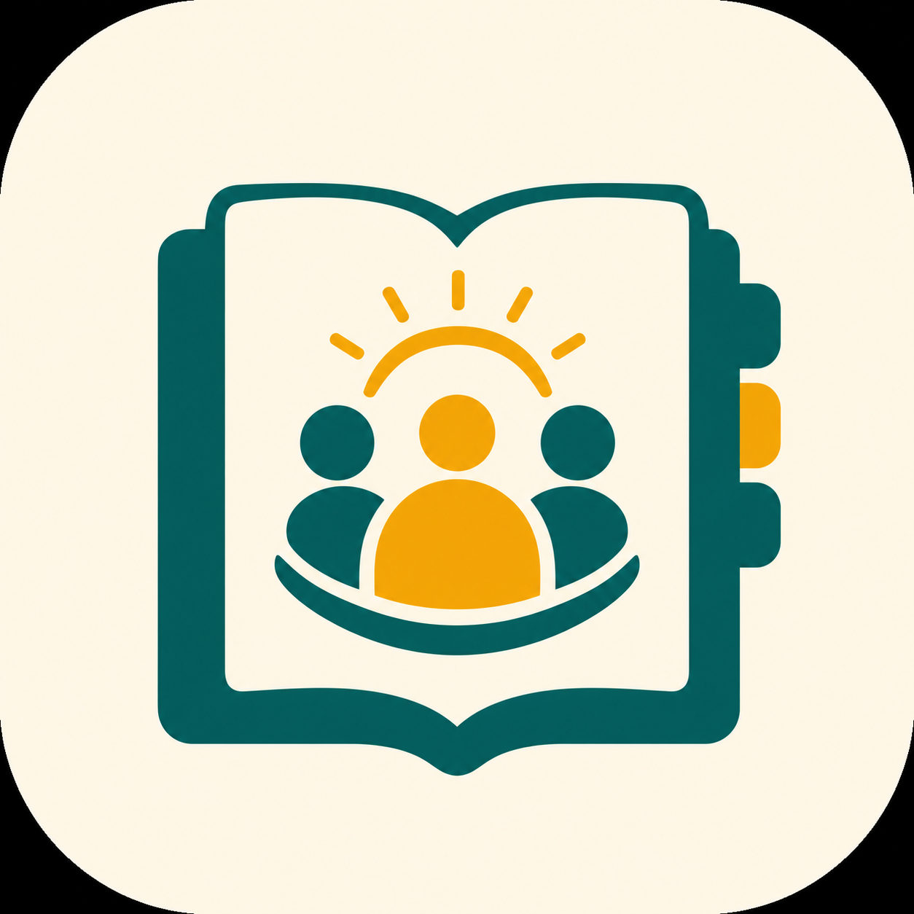

# Rubrica Associati

[Supporto](https://meska.github.io/rubrica-associati/) · [Privacy](https://meska.github.io/rubrica-associati/privacy.html)

<p align="center">
  
</p>

## Scarica l'app

<p align="center">
  <a href="https://apps.apple.com/app/id6791575906"></a>
  <a href="https://play.google.com/store/apps/details?id=it.meska.rubricaassociati"></a>
  <a href="https://apps.microsoft.com/detail/9NMPTTSFPJ9Q"></a>
</p>

I link Google Play e Microsoft Store diventeranno attivi appena le rispettive revisioni saranno concluse. Nel frattempo sono disponibili i download desktop diretti qui sotto.

<p align="center">
  <a href="https://github.com/meska/rubrica-associati/releases/latest/download/rubrica-associati-windows-x64.zip"></a>
  <a href="https://github.com/meska/rubrica-associati/releases/latest/download/rubrica-associati-linux-x86_64.AppImage"></a>
  <a href="https://github.com/meska/rubrica-associati/releases/latest"></a>
</p>

<p align="center">
  <a href="https://github.com/meska/rubrica-associati/releases/latest">Tutti i download dell'ultima versione</a>
  ·
  <a href="https://github.com/meska/rubrica-associati/releases/latest/download/SHA256SUMS-linux-x64.txt">Checksum Linux SHA-256</a>
</p>

App Flutter open source per gestire gli associati di un centro pensionati o di una piccola associazione da telefono o PC.

L'app non invia dati a server e non richiede account o connessione Internet. I dati escono dal dispositivo soltanto quando l'utente sceglie esplicitamente di esportare e condividere un backup.

L'app è e resterà gratuita. Chi vuole sostenere volontariamente lo sviluppo può farlo tramite [GitHub Sponsors](https://github.com/sponsors/meska); la donazione non sblocca funzioni e non è necessaria per usare l'app.

## Funzioni

- elenco associati ordinato per cognome e nome;
- ricerca immediata per nome, cognome, telefono o numero tessera;
- scheda con due telefoni, numero e scadenza tessera, data di nascita e note;
- chiamata rapida tramite il dialer del telefono;
- inserimento, modifica ed eliminazione manuale;
- nome del centro personalizzabile dal menu principale;
- esportazione dell'intera rubrica in un file portabile `.rubrica`;
- condivisione tramite File, AirDrop, email, messaggistica o servizi disponibili sul telefono;
- reimportazione del backup su iOS e Android senza alcun server;
- importazione da Excel `.xlsx` e CSV;
- aggiornamento dei duplicati riconosciuti dal numero tessera o dal telefono;
- evidenza delle tessere scadute;
- interfaccia italiana per iOS, Android, Windows e Linux.

## Condivisione tra dispositivi

Dal menu scegli **Condividi rubrica**. L'app crea un backup come `rubrica-associati-2026-07-16.rubrica` e apre il pannello di condivisione del sistema. Il file può essere salvato in File/Drive, inviato via email o messaggistica e poi importato dall'altro dispositivo con **Importa rubrica / Excel**.

Il backup è versionato e comprende nome, cognome, due telefoni, numero e scadenza tessera, data di nascita e note. In importazione i record esistenti vengono riconosciuti dal numero tessera o da uno dei telefoni e aggiornati senza cancellare campi già valorizzati.

Non è una sincronizzazione automatica in tempo reale: chi riceve un file più recente deve importarlo. Questo mantiene l'app indipendente da iCloud e utilizzabile allo stesso modo su Android e iOS.

## Importazione Excel / CSV

La prima riga deve contenere le intestazioni. Sono riconosciute queste colonne, anche con alcune varianti comuni:

| Colonna | Esempio |
| --- | --- |
| Nome | Maria |
| Cognome | Rossi |
| Telefono | 333 1234567 |
| Secondo telefono | 049 7654321 |
| Numero tessera | A001 |
| Scadenza tessera | 31/12/2027 |
| Data di nascita | 15/04/1952 |
| Note | Volontaria |

È disponibile un file pronto da copiare in [examples/associati-esempio.csv](examples/associati-esempio.csv).

Le date accettate sono `gg/mm/aaaa`, `gg-mm-aaaa` e `aaaa-mm-gg`. Nei file Excel sono accettate anche le vere celle data. Per conservare eventuali zeri iniziali, conviene formattare telefono e numero tessera come testo in Excel.

## Sviluppo

Requisiti: Flutter stable e gli strumenti di compilazione Android/iOS.

```bash
flutter pub get
flutter analyze
flutter test
flutter run
```

Build Android:

```bash
flutter build appbundle --release
```

Build iOS:

```bash
flutter build ipa --release
```

Rilascio TestFlight dal Mac configurato per il progetto:

```bash
cp .env.appstore.example .env.appstore
# Compilare .env.appstore con Key ID e Issuer ID della chiave App Manager.
./scripts/release-testflight.sh
```

Quando la build risulta elaborata su TestFlight, invio alla revisione pubblica:

```bash
./scripts/submit-app-store.sh
```

Gli script usano firma manuale e una chiave App Store Connect con ruolo App Manager: non richiedono password Apple ID o codici 2FA. Prima di ogni rilascio vanno aggiornati versione/build in `pubspec.yaml` e `app_store/metadata/it/release_notes.txt`. La pubblicazione crea la versione, seleziona la build, carica le note, invia alla revisione e abilita il rilascio automatico dopo l'approvazione. La chiave privata `.p8`, il certificato Distribution e il provisioning profile rimangono fuori dal repository.

Build Windows (da un computer Windows con Visual Studio e il workload C++ desktop):

```powershell
flutter build windows --release
./scripts/build-msix.ps1 -SkipBuild
```

Ad ogni push GitHub Actions compila la versione portabile Windows e pubblica sia lo ZIP sia il pacchetto MSIX per Microsoft Store. Lo script ricava automaticamente la versione MSIX da `pubspec.yaml`: per esempio `1.6.1+9` diventa `1.6.1.0`, perché Microsoft Store richiede la revisione finale a zero.

Build Linux (con toolchain C++, CMake, Ninja e GTK 3):

```bash
flutter build linux --release
./scripts/build-linux-packages.sh
```

La CI produce automaticamente:

- `rubrica-associati-linux-x86_64.AppImage`, eseguibile sulle principali distribuzioni x64;
- `rubrica-associati_<versione>-<build>_amd64.deb`, per Debian, Ubuntu e derivate;
- `rubrica-associati-linux-x64.tar.gz`, archivio portatile;
- `SHA256SUMS-linux-x64.txt`, per verificare l'integrità dei download.

Quando viene pubblicato un tag `vX.Y.Z`, gli stessi file vengono aggiunti alla GitHub Release corrispondente.

La configurazione iOS usa il bundle ID `it.meska.rubricaassociati` e il profilo App Store `Rubrica Associati App Store`.

## Privacy e backup

Il database SQLite si trova nell'area privata dell'app. Disinstallare l'app elimina normalmente anche i dati locali. Prima dell'uso operativo è consigliato conservare il foglio Excel originale come backup protetto e limitare l'accesso al telefono con codice o biometria.

I file `.rubrica` contengono dati personali in formato JSON leggibile e non sono cifrati. Devono quindi essere condivisi solo con persone autorizzate e conservati in una posizione protetta.

Questa versione trasferisce i dati manualmente tramite file e non li sincronizza automaticamente. Un'eventuale sincronizzazione in tempo reale dovrà essere progettata con autenticazione, autorizzazioni e cifratura adeguate ai dati personali trattati.

## Licenza

[MIT](LICENSE)
